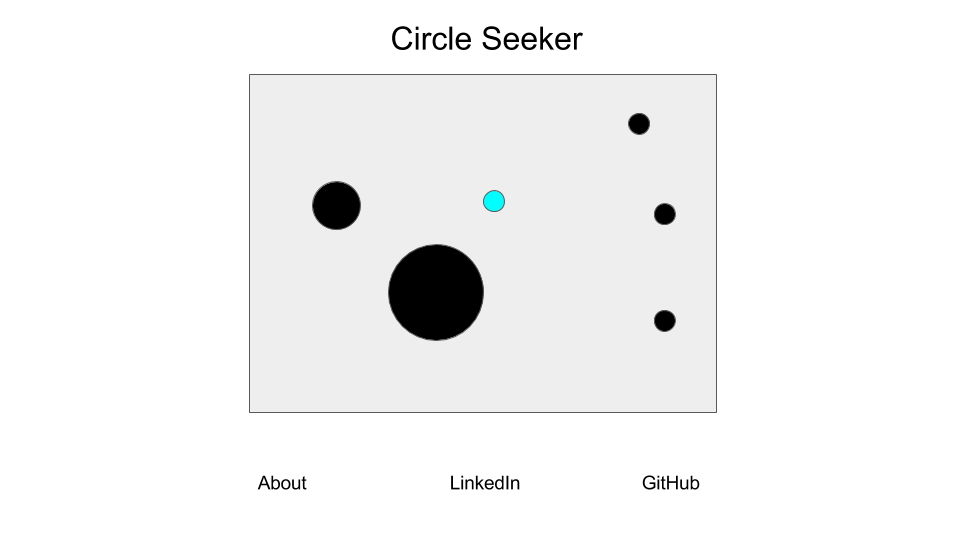

# Dotty Dots

## Background
Dotty Dots is a game with a simple goal: eat your neighbors until you are the sole circle remaining in the world. Users control a character and traverse a 2D environment, eating smaller circles (or colliding their character into them) while avoiding larger circles. There are four rules to the game:
1. Eat smaller circles
1. Don't get eaten by larger circles
1. Small circles will avoid your character
1. Large circles will charge at your character

## Functionality
While playing Dotty Dots, players will have the option to:
1. Control a character with the W A S and D keys
1. Press the spacebar key to activate an emergency lifesaving measure

## Wireframes
This app will consist of a single screen which contains a title, a HTML canvas element, and links to an about modal, my linkedin profile, and my github account.

## Architecture
This app will be implemented using the following libraries:
1. Vanilla javascript and jquery for DOM management
1. Webpack to bundle files
1. EaselJS to render HTML 5 elements
1. SoundJS to play sound effects as applicable.

## Implementation Timeline
Day 1:  
Complete a lot of the initial set up and being learning about Easel
* Complete html document which will house the game
* Configure webpack
* Set up github Repo
* Configure package.json as needed
* Learn about Easel

Day 2:  
Develop a moving objects class which will have methods to:
* Update location
* Determine collisions with border
* Update velocity based on border collisions
* Remove itself from the canvas

Develop an instance of the moving object class for other circles which will have methods to:
* Determine collisions with other objects
* Update velocity based on type of colliding object

Develop an instance of the moving object class for the user circle which will have methods to:
* Change the velocity of the character based on keyboard inputs
* Push other circles away from the character on a spacebar input.
* Update it's own size based on collisions with other objects

Day 3:
Develop game logic which will
* Initiate on document load
* Provide instructions to the user
* Populate the game with instances of the other circle
* Determine if the player is still alive or not
* Develop methods for circles to charge or flee from the user based on the relative radii
* Displays an image indicating you lost if the character has died.

Day 4:
* Style as needed
* Add sound effects for eating and being eaten situations.

## Bonus Features
Time permitting, there are several options I would like to implement:
* Include animations for deaths and consumption of other circles
* Include an "autopilot" feature which automatically avoids larger circles for the user
