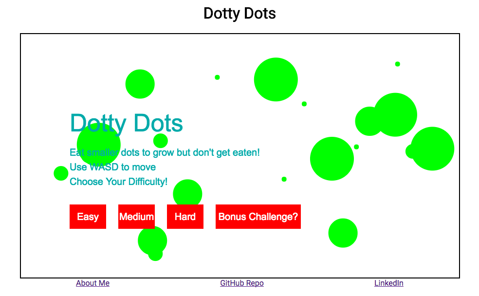

# Dotty Dots
# [Live Link](http://tianjyang.github.io)
## Background
Dotty Dots is a game with a simple goal: eat your neighbors until you are the sole circle remaining in the world. Users control a character and traverse a 2D environment, eating smaller circles (or colliding their character into them) while avoiding larger circles. There are five rules to the game:

1. Eat smaller circles
1. Don't get eaten by larger circles
1. Small circles will avoid your character
1. Large circles will charge at your character
1. Triangles (Bonus Challenge) will shoot at you


## Features
Dotty Dots features:

1. A character which can be controlled with the W A S and D keys
1. Collision detection between all moving objects and the edge of the canvas
1. Vector math to calculate trajectories of characters
1. Ability of NPC dots to flee or charge at the user character
1. Three difficulty levels with an option to include a bonus challenge

## Wireframes
This app will consist of a single screen which contains a title, a HTML canvas element, and links to an about page, my linkedin profile, and my github account.



## Architecture
This app will be implemented using the following libraries:

1. Vanilla javascript and jquery for DOM management
1. Webpack to bundle files
1. EaselJS to render HTML 5 elements
1. SoundJS to play sound effects as applicable.

## Implementation Timeline
Day 1:  
Complete a lot of the initial set up and being learning about Easel
* Complete html document which will house the game
* Configure webpack
* Set up github Repo
* Configure package.json as needed
* Learn about Easel

Day 2:  
Develop a moving objects class which will have methods to:
* Update location
* Determine collisions with border
* Update velocity based on border collisions
* Remove itself from the canvas

Develop an instance of the moving object class for other circles which will have methods to:
* Determine collisions with other objects
* Update velocity based on type of colliding object

Develop an instance of the moving object class for the user circle which will have methods to:
* Change the velocity of the character based on keyboard inputs
* Push other circles away from the character on a spacebar input
* Update it's own size based on collisions with other objects

Day 3:
Develop game logic which will
* Initiate on document load
* Provide instructions to the user
* Populate the game with instances of the other circle
* Determine if the player is still alive or not
* Develop methods for circles to charge or flee from the user based on the relative radii
* Displays an image indicating you lost if the character has died

Day 4:
* Style as needed
* Add sound effects for eating and being eaten situations
* Develop a new class of objects which fires bullets at player

## Sample Code
### Color Transition
The following code was developed to transition a npc dot to a different color depending on whether it was frightened or angry at the user. Color is stored as a three element array (corresponding to rgb values) and represents an asymptotic transition to the target color.
```
transitionColor(color){
  let newColor = [];
  for (var i = 0; i <3; i++) {
    newColor[i] = Math.floor(0.1*(color[i] - currentColor[i]) + currentColor[i]);
  }
  currentColor = newColor;
}
```

### Vector Mathematics
To reduce redundancy in the code, I developed a library of vector functions that I commonly used to manipulate velocities. This can be found [here](assets/utils.js).

### EaselJS Class Extensions
To group functions common to all classes, I created a MovingObjects class which inherits from the createJS.Shapes. This allowed me to directly access properties relevant to createJS objects and develop methods common to all moving objects.
```
class MovingObjects extends createjs.Shape {
  //Methods to update position and instantiate an object here
}
```
Each specific element is then an extension of the MovingObjects class. Methods specific to updating the state of an object is then defined in these sub classes.
```
class BlasterDot extends MovingObjects {
  //methods to detect users dot and fire bullets here, etc.
}

class Bullets extends MovingObjects {
  //methods to instantiate lifetime timer, etc.
}

class NpcDots extends MovingObjects {
  //methods to change color, update velocity, etc.
}

class UserDot extends MovingObjects {
  //methods to update velocity based on user input, etc.
}

```
